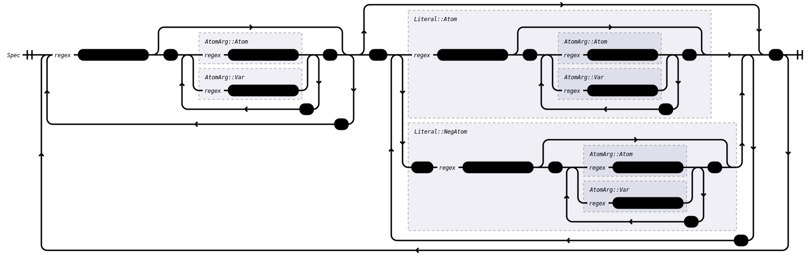

# JustAct: Datalog with Negation
This crate implements a simple Datalog dialect that supports negation-as-failure, $Datalog^\neg$.

The specific semantics of this language are discussed below. This language is used in JustAct-framework paper [1] (see the [root README](/README.md) for references) as a simple example policy language.


## Semantics
$Datalog^\neg$ has a very simple semantics.

### Rules
The language consists of a set of _logical rules_ that assign truth values to atoms. Simply put, every rule is an implication, where one or more _consequents_ are derived as true if zero or more _antecedents_ hold. As usual, the antecedents are considered conjunct, i.e., _all_ of them have to hold in order to derive the consequents.

For example:
```datalog
foo :- bar.            // Derives 'foo' if 'bar' is true.
foo, bar :- baz, quz   // Derives 'foo' AND 'bar' if 'baz' AND 'quz' are true.
foo.                   // Always derives 'foo'.
```

Note that the rules themselves are disjunct, i.e., only on of the rules above has to hold to derive `foo`.

### Atom arity
Atoms can have other atoms as arguments in order to specify relations between objects. However, "nesting" of these atoms is forbidden: only _constants_ (i.e., atoms with arity 0) are accepted as arguments to _functions_ (i.e., atoms with arity > 0).

For example:
```datalog
foo(bar).         // OK, atom 'foo' with arity 1 has constant 'bar' as argument (arity 0)
foo(bar(baz))     // Illegal, function `bar` is argument to function `foo`
foo(bar, baz)     // OK, atom 'foo' has arity 2
```

### Negation
Even though $Datalog^\neg$ is said to support negation, it only does so as failure, i.e., when some atom is _not_ derived as true. As such, some antecedents (but only antecedents) may be negative, implying that the consequent should only be derived as true if that antecedent is _not_ derived as true.

Note that this means that falsity _cannot_ be derived; it can only occur as a failure of deriving truth.

This implementation of $Datalog^\neg$ uses the alternating fixed-point semantics [2] to compute a program's denotation, meaning that contradictory logical rules (e.g., `foo :- not foo`) will result in `foo` being **unknown** instead of being assigned a true- or false value.

For example:
```datalog
foo :- not bar.        // Only derives 'foo' if 'bar' was _not_ derived.
not foo.               // Illegal; only antecedents can be negative.
foo :- not foo.        // 'foo' will become 'unknown'
```


## Syntax
The following represents the concrete syntax of $Datalog^\neg$ as a railroad diagram.




## JustAct
As far as JustAct goes, $Datalog^\neg$ implements the `Policy` and the `ExtractablePolicy` features as follows:
- `Policy::check_validity()`: A policy is only valid if and only if `error` is not `true` in the interpretation of a `Spec` according to the alternating fixpoint semantics.
- `ExtractablePolicy::extract_from()`: A policy is extracted by parsing it as valid Datalog from the message's payloads. In addition, if any consequent is controlled (i.e., it starts with `ctl-`), then its first argument must be the author of the message. Else, an additional rule `error.` is extracted.


## Features
This crate supports the following features:
- `derive`: Enables the `datalog!()`-macro for writing $Datalog^\neg$-programs as a Rust embedded DSL.
- `interpreter`: Enables the `alternating_fixpoint`-functions to allow derivation for the $Datalog^\neg$-programs.
- `justact`: Adds implementations for `justact_core::Policy` and `justact_core::ExtractablePolicy`. Implies `interpreter` and `parser`.
- `log`: Enables `log`-traces during the derivation process for debugging purposes.
- `parser`: Enables a parser that can parse $Datalog^\neg$-programs from source text.
- `railroad`: Enables implementations of `ToNode` and associated traits from the [`ast-toolkit-railroad`](https://github.com/Lut99/ast-toolkit-rs) for AST nodes. This allows railroad diagrams to be generated (see the [`railroad.rs`](./examples/railroad.rs)).
